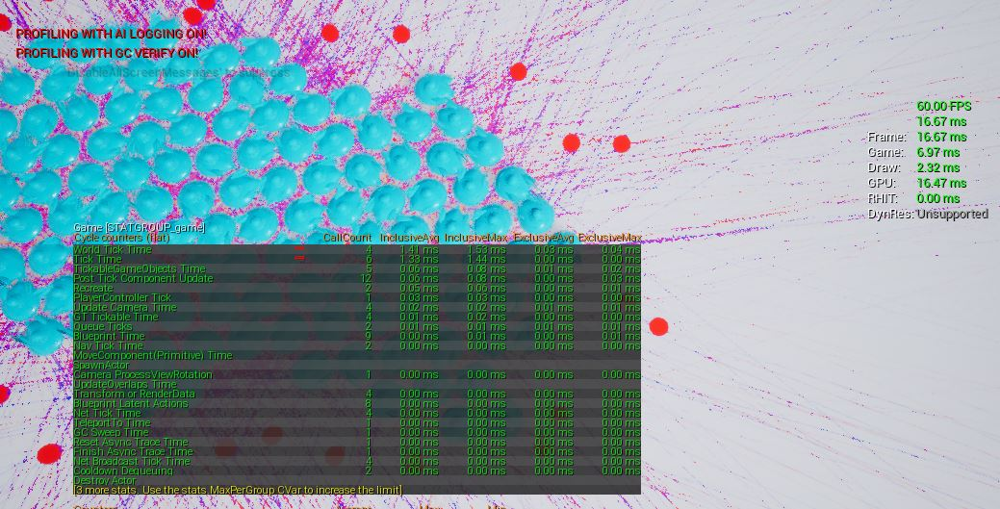
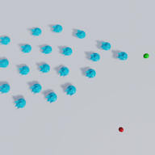

# FlockAI
Implementation of flocking behavior AI developed in Unreal Engine 4.

Authors: 
 - Juan Belón (juaxix) [new version]
 - [old] Pablo Rodriguez (parmandorc) - base version for UE4.7
 

## Relevant links
- Watch the new version 2.0 [gameplay video] (https://youtu.be/mxAPeElz37Q)
- Watch the old [video preview!](https://youtu.be/39Wc7Bgj5gI)
- Download a compiled version for windows: [here](https://www.dropbox.com/s/sen4xigl7f0402c/FlockAI_by_juaxix.zip?dl=0)
 

## Instructions for the game
- Basic movement using WASD or arrows. (Note: You don't control the agents (boids), you can just move the camera around)
- Mouse wheel to zoom in and out.
- Mouse left clic to spawn new Boids to the scene.
(Hold left clic and move the mouse to orient the starting direction of the agent (boid), or right clic to cancel spawning).
- Press 2 in order to spawn Positive Stimuli (or food) instead when left clicking.
- Press 3 in order to spawn Negative Stimuli (or enemies) instead when left clicking.
- Press 1 again to spawn new Boids.

## About this project
This project implements a traditional flocking AI algorithm, with its 3 traditional components:
- Alignment: agents (boids) will face the same direction as their neighbors.
- Cohesion: agents (boids) will try to stay together as a group.
- Separation: agents (boids) will try to steer away from very close neighbors so the group doesn't collapse.

Nevertheless, while the traditional algorithm uses normalized vectors, this project takes a different approach by taking into account the distance between agents (boids). This means for instance that an agent (boid) will try to separate from its neighbors more intensely if they are about to collide than if they are rather far away, which provides a much more realistic behavior.

Another new aspect is the introduction of external stimuli to the agents (boids). This means they will react to points of interest in their field of view, simulating behaviors like going towards food or avoiding an enemy.

The purpose of this project is to create a very optimized method using Unreal Engine for flocking, including different component forces (vectors) as behaviors. This is achieved by using only one Tick function for all the Agents (now Boids) inside an Agent-Manager and one DrawCall per material of the instanced static mesh component; this means that there is only one object to draw for all the boids and multiple mesh instances. We use the optimized algorithm coming in the [Craig Reynolds](https://www.red3d.com/cwr/steer/) list, and this method leads me to the possibility of having thousands of boids instead of only a few ,hundreds at least if using old approach.
